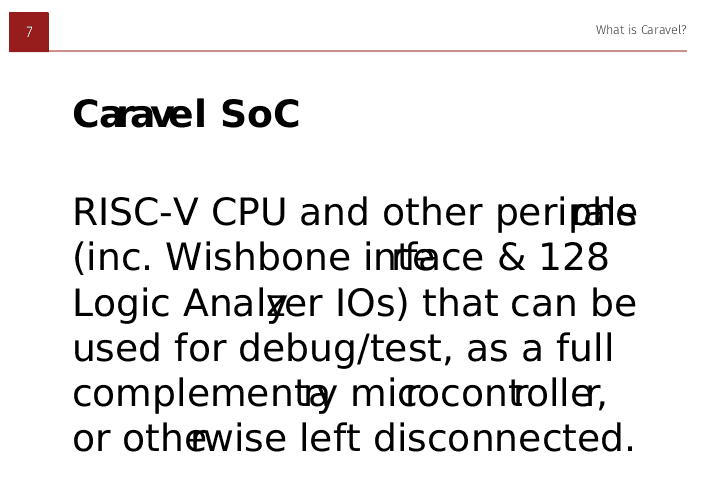

# Documentation source for Caravel Frame and SoC

> [!CAUTION]
> This documentation is an early work-in-progress and should not be used yet!

This is the Sphinx source code for new Caravel "readthedocs"-style documentation intended to replace (or at least supersede) https://caravel-mgmt-soc-litex.readthedocs.io and https://caravel-harness.readthedocs.io

## Decisions made

*   Continue using Sphinx as the documentation compiler, for compatibility with existing docs.
*   Keep using `.rst` (reStructuredText) instead of `.md` (Markdown). I'm not sold on RST yet, but others are more familiar with it (plus existing doco we want to migrate is written with it), and it has some good extensibility.
*   Retain the [`docs/`](./docs/) subdirectory so this can be planted into an existing repo (say, [caravel]) later.
*   Switch to the [Wagtail theme](https://sphinx-wagtail-theme.readthedocs.io/) because it looks nice, supports full-width layouts and mobile views, and renders complex tables more sensibly.


## Setting up

```bash
python3 -m venv --prompt caravel_docs .venv
source .venv/bin/activate
pip install -r docs/requirements.txt
```


## Building and viewing the documentation

> [!NOTE]
> I built this using Sphinx 7.3.7 which is the default that pip installed.

First:

```bash
source .venv/bin/activate
cd docs
```

Then for each build:

```bash
make html  # Updates docs/build/html/
```

And to view it (maybe persisting in a separate terminal):

```bash
python3 -m http.server --directory build/html
```

...and open http://localhost:8000/ in a web browser.


## Viewing live updates during development

Instead of doing a manual build (e.g. `make html` then running the Python HTTP server), you can set up a live build-and-serve process that watches as you update source files:

```bash
sphinx-autobuild source build --host 0.0.0.0
```

Or simply:
```bash
./live.sh
```

## DRAFT vs. Production mode

By default, [`conf.py`](./docs/source/conf.py) is configured so that `DRAFT=True` which causes some deliberately ugly stuff to appear:
*   TODOs
*   Highlighting of stuff that is TBC (To Be Confirmed)
*   Warning messages on every page.

You can disable DRAFT mode by setting the environment variable `DRAFT` to (say) `0` or `False`, e.g. by prefixing any command given here with `DRAFT=0` OR `DRAFT=False` -- Example:
```bash
DRAFT=0 ./live.sh
```

At the time of writing, while `DRAFT=True` is the default (if not otherwise specified), this might change in future.


## Editing

I use VSCode. I have these extensions installed (but not sure whether I actually *benefit* from all or not):
*   [reStructuredText][rst] (`lextudio.restructuredtext`)
*   [reStructuredText Syntax highlighting][rstsh] (`trond-snekvik.simple-rst`)
*   [Esbonio][esbonio] (`swyddfa.esbonio`) -- I'm not sold on this one yet. It always complains about the server not working. Not sure what it's actually for, but I think it's bundled with the "reStructuredText" extension above anyway, and it's maybe for analyzing your content/doctree to provide easier cross-linking and intellisense...?


## Customization

[`docs/source/conf.py`](./docs/source/conf.py) contains Sphinx configuration for how this documentation should be built, and its appearance.


## readthedocs

[readthedocs.io](https://readthedocs.io) is a service which automates the building and hosting of documentation, typically using Sphinx. It can watch pushes to this repo and automatically handle building/deployment. It relies on [`.readthedocs.yaml`](./.readthedocs.yaml)


## Special features of this doco

Most of this stuff is defined/managed in [conf.py](docs/source/conf.py):

*   `.. todo::` admonitions have custom CSS to really make them stand out.
*   The `tbc` role (e.g. `` You can :tbc:`push the button anytime` and it will work ``) marks a piece of text as 'To Be Confirmed', i.e. assumed to be correct, but needs to be verified.
*   The `todo` role (e.g. `` You can reset the CPU in many ways. :todo:`Define them.` ``) is like a comment for something the authors need to do (as opposed to actual content that could be included.)
*   `DRAFT` can be set to:
    *   `True`: Enable rendering of `todo` items, and visually mark/highlight `tbc` inline content.
    *   `False`: Prevent rendering of `todo` items, and apply a basic CSS style to `tbc` content so it doesn't stand out.
*   [`docs/source/_templates/substitutions.rst`](docs/source/_templates/substitutions.rst) contains shorthands that can be included inline in pages, to replace them with more elaborate content (or later, alternative content if required), e.g. `|caravel_board|` becomes a nicer representation of the name of the board and a link to its definition.


# PDF generation

## Overview

My first attempt with PDF generation was using [Sphinx-SimplePDF](https://sphinx-simplepdf.readthedocs.io/en/latest/index.html) but I'm not sure if it's a good choice. It doesn't have a lot of documentation yet, and it hasn't been updated since Nov 2023 (at the time of writing).

If you want to try this out, though, do:

```bash
cd docs
DRAFT=0 make clean simplepdf
```

...and it will generate `build/simplepdf/caravel_frame_and_soc.pdf`

The default styling of the PDF looks somewhat nice (coincidentally, our Efabless red or close enough to it), and it can be modified a bit through CSS and other means. Just note that it might not go as far as we need. 

## Possible PDF generation issues

Here are some points to consider about Sphinx-SimplePDF:
*   It hasn't been updated in a year.
*   The documentation is weak. Maybe the functionality is too.
*   There might be other PDF generators (maybe also coupled with Sphinx) that are more popular.
*   I haven't yet been able to get it to do sensible page breaks before certain headings.
*   I doubt it can do two-column layouts (but do these matter?)
*   Rendering of superscript (e.g. "10mm<sup>2</sup>") is a bit weird with extra X/Y margins.
*   There is trailing margin on (say) bold/strong elements.
*   Links in a PDF should be rendered as text also (but maybe this can be fixed with CSS `content`).
*   Rendering of `index.rst` content (esp. its headings) is weird/different from the rest of the documents. This might be an issue more-generally with Sphinx, though.
*   It's not clear how to set the size of images in a way that has any effect on the image in the PDF. None of `em`, `px`, `%` or `mm` have any effect on the image in the output PDF.

To include SVGs and have them properly rendered in the output PDF, you will likely need to:
*   install any fonts that the SVGs use -- for example, install 'Roboto' with: `sudo apt install fonts-roboto`
*   or ensure the fonts are outlined, e.g. converted to shapes rather than retained as text (which is not so great because they can no longer be searched or copied);
*   **or (better)** embed them in the SVG, but this can be difficult/non-standard. For more info see [here](https://developer.mozilla.org/en-US/docs/Web/SVG/Tutorial/SVG_fonts), [here](https://dee.underscore.world/blog/embedding-fonts-in-svgs/), and [here](https://oreillymedia.github.io/Using_SVG/extras/ch07-dataURI-fonts.html). I haven't tried to work out yet how SimplePDF does its SVG=>PDF conversion.

Before and after doing `sudo apt install fonts-roboto`, here's the result of two different renders of the documentation to PDF (i.e. the 'Before' error is in the PDF itself, not simply in how the PDF is displayed):

| Before: | After: |
|-|-|
|  |  |


[caravel]: https://github.com/efabless/caravel
[rst]: https://marketplace.visualstudio.com/items?itemName=lextudio.restructuredtext
[rstsh]: https://marketplace.visualstudio.com/items?itemName=trond-snekvik.simple-rst
[esbonio]: https://marketplace.visualstudio.com/items?itemName=swyddfa.esbonio
