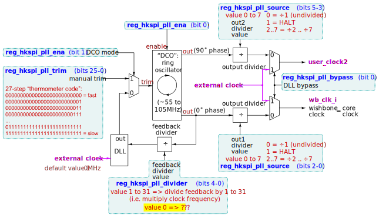

.. raw:: html

   <!---
   # SPDX-FileCopyrightText: 2020 Efabless Corporation
   #
   # Licensed under the Apache License, Version 2.0 (the "License");
   # you may not use this file except in compliance with the License.
   # You may obtain a copy of the License at
   #
   #      http://www.apache.org/licenses/LICENSE-2.0
   #
   # Unless required by applicable law or agreed to in writing, software
   # distributed under the License is distributed on an "AS IS" BASIS,
   # WITHOUT WARRANTIES OR CONDITIONS OF ANY KIND, either express or implied.
   # See the License for the specific language governing permissions and
   # limitations under the License.
   #
   # SPDX-License-Identifier: Apache-2.0
   -->

Clocking and DLL/DCO
====================

.. todo::
   Put in DLL/DCO/clocking diagram inc. register names.

.. todo::
   Simplify the idea that there is a DCO, DLL, and configurable dividers (as well as bypass). Maybe the diagram above will do this. Otherwise it's confusing: The DCO can be 'divided', but with feedback it becomes a DLL.

Caravel has a dedicated |clkin| input pin. While it is not mandatory to make use of this for any design submitted to chipIgnite, an external clock source is (in most cases) required in order for most parts of the Caravel SoC to be used.

   Caravel clocking diagram

The Caravel SoC's RISC-V CPU derives its core clock from the |clkin| pin, as do the following peripherals that can be used by the CPU:

*  :doc:`UART <uart>`
*  :doc:`SPI Controller <spi-controller>`
*  :doc:`Counter/Timer <counter-timer>`

Note that :doc:`HKSPI <housekeeping>` can be used without using the Caravel |clkin| pin, as it has its own dedicated :ref:`SCK <sck>` clock input.

At power-on (and during any reset state) the clock signal present on the |clkin| pin is passed, unmodified, directly to the CPU and other dependent peripherals, and is also available as an incoming signal in the user project area via both |clk1| and |clk2|.

The CPU or HKSPI may modify this clock path, e.g. to enable the :ref:`DLL <dll>` (and hence multiply and divide it to derive a different clock frequency), or to switch to using Caravel's internal ring oscillator (:ref:`DCO <dco>`) as the clock source.

While the Caravel SoC has limited clock source options, if *your own user project* requires a clock source then you might choose to use any of:

*  :ref:`wb_clk_i` -- recommended for synchronous interfacing with the Caravel CPU (e.g. via :doc:`wishbone` or :doc:`logic-analyzer`).
*  |clk2|
*  Any GPIO input pin
*  A Caravel-controlled :doc:`logic-analyzer` pin
*  Your own internal oscillator, e.g. a ring oscillator

Of the options given, |clk1| and |clk2| are preferred because they have :tbc:`known timing characteristics` and can either be derived from Caravel's internal ring oscillator (:ref:`DCO <dco>`) or from Caravel's external dedicated |clkin| input pin -- in both cases optionally also being modified by the DLL/divider circuits as described. In turn this means that they can be controlled, to a degree, by firmware running on the CPU.

.. todo::
   Do we need to describe the two clock dividers (wb_clk_i and user_clock2) as being a part of, or separate from the DLL?

.. _dll:

DLL (Delay-Locked Loop)
-----------------------

The Caravel DLL is like a :term:`PLL` as found in an FPGA. The Caravel frame has a dedicated "|clkin|" input pin.

.. todo::
   Other points to include:

   *  To NOT divide the clock, enable 'bypass' mode or set divider to 0.
   *  Setting a divider to 1 will STOP the respective clock, and it can only be reactivated by doing a POR.

.. _dco:

DCO (Digitally-Controlled Oscillator)
-------------------------------------

This is an internal ring oscillator with a fixed base frequency and which can be "trimmed" by up to 26 steps to control its actual output frequency. It is used by the DLL to generate a :tbc:`reasonably stable` multiple of the input clock source, but can also be used simply as a direct clock source instead of the |clkin| input pin. In this mode it can optionally be divided by two independent integer dividers (to produce each of |clk1| and |clk2|).

Note that the actual internal DCO frequency is :term:`PVT`-dependent.

.. _wb_clk_i:

wb_clk_i
--------

``wb_clk_i`` is the core clock used by the Caravel CPU and related peripherals. It is also available inside the |upw|.

.. _user_clock2:

user_clock2
-----------

When the DLL is enabled, the clock source feeding ``user_clock2``'s divider is 90 degrees out of phase. That is, ``user_clock2`` lags |clk1| by a quarter-cycle.

Clock monitoring
----------------

.. todo::
   Flesh this out.

It's possible to monitor |clk1| and/or |clk2| via GPIO pins, which can help with debugging your clock source and DLL/DCO behavior.

Caravel can use GPIOs 15 and 14 for this purpose, while Caravan (:tbc:`for chips fabricated as of June 2023`) can use GPIOs 31 and 30 instead.

Enabling this feature requires setting the respective GPIO(s) to |mgmt_out| mode, and then setting one or two bits of the clock monitor register: HKSPI register 0x1B (in firmware, this is ``reg_clk_out_dest`` or address ``0x26200004``).

*  For Caravel: Monitoring of |clk1| and |clk2| is via GPIOs 15 and 14 respectively. These are respectively enabled by writing ``1`` to bits 2 and/or 1 of the clock monitor register.
*  For Caravan: Monitoring of |clk1| and |clk2| is via GPIOs 31 and 30 respectively. These are respectively enabled by writing ``1`` to bits 4 and/or 3 of the clock monitor register.
