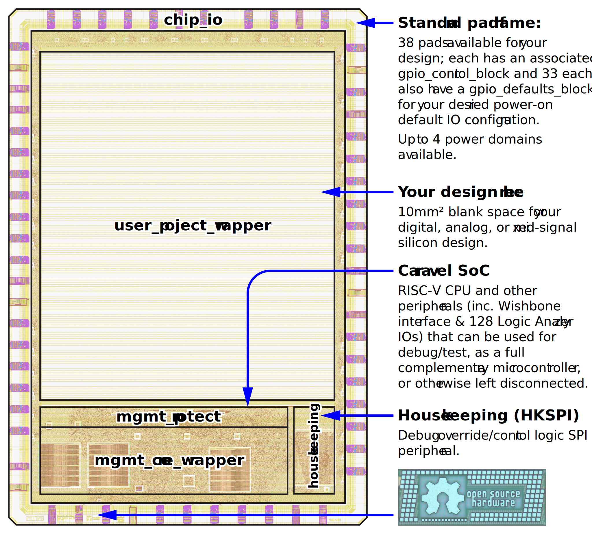

.. Caravel Frame and SoC documentation master file, by sphinx-quickstart.
   This file should at least contain the root `toctree` directive.

.. raw:: html

   <!---
   # SPDX-FileCopyrightText: 2020 Efabless Corporation
   #
   # Licensed under the Apache License, Version 2.0 (the "License");
   # you may not use this file except in compliance with the License.
   # You may obtain a copy of the License at
   #
   #      http://www.apache.org/licenses/LICENSE-2.0
   #
   # Unless required by applicable law or agreed to in writing, software
   # distributed under the License is distributed on an "AS IS" BASIS,
   # WITHOUT WARRANTIES OR CONDITIONS OF ANY KIND, either express or implied.
   # See the License for the specific language governing permissions and
   # limitations under the License.
   #
   # SPDX-License-Identifier: Apache-2.0
   -->

Caravel Frame and SoC documentation
===================================

.. todo::
   Include a summary like what the caravel_datasheet_2 currently has.

.. todo::
   Don't have too much on this page because it is easily overlooked (i.e. can't be in the TOC??) just like it is for `CMSL <https://caravel-mgmt-soc-litex.readthedocs.io/en/latest/>`_. We also don't want it to be too long.

What is Caravel?
----------------

.. raw:: html

   

   With the free and open-source <strong>Caravel</strong>, you have a ready-to-use chip harness for creating your own ASIC design and getting it fabricated for prototype or production purposes. It includes a blank silicon <strong>design area of 10mm2</strong> and optional on-chip microcontroller/test framework. You can use it whether you are creating a proprietary/private chip, one for commercial purposes, or an open-source design.
   

"**Caravel**" is both the name of:

*  an **Efabless chipIgnite chip template** (including padring); and
*  its included **ready-made silicon SoC** (system-on-chip, i.e. CPU and other useful devices).
   
These parts are open source, but you may also freely use them for any closed/commercial/private project.

Designing and fabricating an ASIC with `Efabless chipIgnite <https://efabless.com/chipignite>`_ requires that you use an existing supported template (or "frame"), and Caravel is recommended as the most popular, feature-rich, and production-ready template. The chipIgnite submission process automatically integrates your user project design area into the frame, so you don't have to worry about it.

.. hint::
   While this documentation describes **Caravel**, it also covers **Caravan** (our frame with some dedicated bare analog pads, suitable for prototyping) and **Caravel Mini**. All 3 are very similar, with some specific distinctions marked where appropriate.

   For more information about the different frames and options, see: `Which chipIgnite template should I use? <https://info.efabless.com/knowledge-base/whats-the-difference-between-caravel-caravan-and-openframe>`_

.. todo::
   Make it clear that there's a "minimal" start point that allows you to ignore most of the rest of the SoC stuff. Perhaps have a panel like this one that points to a quick-start or basic guide. Otherwise the SoC block diagram looks complicated. Maybe having a simple block diagram (that abstracts the SoC away) will go well adjacent the following die floorplan diagram...

      Caravel die floorplan

.. todo::
   Clarify that the user_project_wrapper is what you submit, but it's also a part of the overall frame that gets replaced by your own submission.

How do I use this guide?
------------------------

It is intended that you can work through each of the following sections in order to learn the basics of Caravel and how to use it, before reaching more advanced topics.

This guide covers general use of Caravel as a chip padring/harness for essential support of your design, as well as programming the Caravel SoC as a microcontroller and interfacing it with your design, and more-advanced concepts like analog connections.

.. toctree::
   :maxdepth: 2

   caravel-features
   pinout
   Getting Started <getting-started>
   clocking
   Firmware/Programming <firmware>
   simulation
   gpio
   logic-analyzer
   uart
   wishbone
   spi-master
   counter-timer
   housekeeping
   irq
   memory-map
   analog
   advanced
   Bringup (Caravel Eval) <bringup>
   caravan
   caravel-mini
   figures
   specs
   pcb
   glossary
