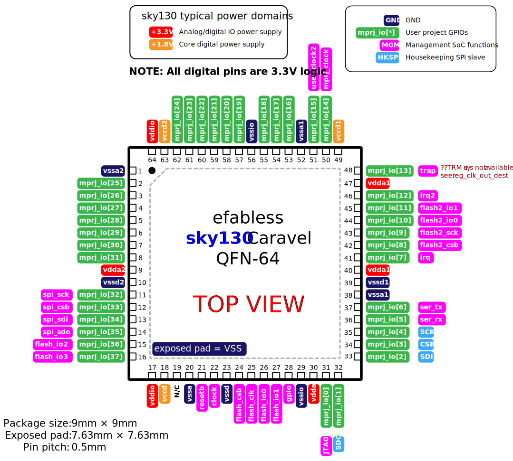

.. raw:: html

   <!---
   # SPDX-FileCopyrightText: 2020 Efabless Corporation
   #
   # Licensed under the Apache License, Version 2.0 (the "License");
   # you may not use this file except in compliance with the License.
   # You may obtain a copy of the License at
   #
   #      http://www.apache.org/licenses/LICENSE-2.0
   #
   # Unless required by applicable law or agreed to in writing, software
   # distributed under the License is distributed on an "AS IS" BASIS,
   # WITHOUT WARRANTIES OR CONDITIONS OF ANY KIND, either express or implied.
   # See the License for the specific language governing permissions and
   # limitations under the License.
   #
   # SPDX-License-Identifier: Apache-2.0
   -->

Caravel Pinouts
===============

All chips fabricated using the Caravel harness have a standard pinout with some pins dedicated to the SoC (i.e. the CPU), some for power, most for user-configurable GPIOs, and a few with shared functions.

Caravel chips can be ordered in a 64-pin :term:`QFN` package, or as bare dice (unpackaged, bare silicon chips).

Older generations of chipIgnite and the Open MPW shuttles also supplied :term:`WLCSP` packaged parts.

.. todo::
  Work out the best way to present the pin placement/numbering for different packages, but also clarify the different pin functions (inc. shared pins). Maybe we need a pin-number-to-name list and a pin-name-to-function list that it can link to. Otherwise, just abandon all but QFN64 numbering? Also, should the list be sorted by function or by pin number, or by functional group? Maybe this can be dynamic on the web, but we need to decide for the PDF version too.

.. rst-class:: break_before, ssp-landscape, break_after

Caravel pins and functions
--------------------------

.. list-table:: Pin description
      :name: pin-description
      :header-rows: 1
  
      * - Name
        - Type
        - Description
      * - .. _mprj_io:
  
          ``mprj_io[37:0]``
        - Digital I/O
        - General purpose configurable digital I/O with pullup/pulldown, input or output, enable/disable, analog output, high voltage output, slew rate control.
          Shared between the user project area and the management SoC.
      * - .. _flash_clk:
  
          ``flash_clk``
        - Digital out
        - Flash SPI clock
      * - .. _flash_csb:
  
          ``flash_csb``
        - Digital out
        - Flash SPI chip select
      * - .. _flash_io:
  
          ``flash_io[1:0]``
        - Digital I/O
        - Flash SPI data input/output
      * - .. _clock:
  
          ``clock``
        - Digital in
        - External CMOS 3.3V clock source
      * - .. _resetb:
  
          ``resetb``
        - Digital in
        - SoC system reset (sense inverted)
      * - .. _sdo:
  
          ``SDO``
        - Digital out
        - Housekeeping serial interface data output
      * - .. _sdi:
  
          ``SDI``
        - Digital in
        - Housekeeping serial interface data input
      * - .. _csb:
  
          ``CSB``
        - Digital in
        - Housekeeping serial interface chip select
      * - .. _sck:
  
          ``SCK``
        - Digital in
        - Housekeeping serial interface clock
      * - .. _ser_tx:
  
          ``ser_tx``
        - Digital out
        - UART transmit channel
      * - .. _ser_rx:
  
          ``ser_rx``
        - Digital in
        - UART receive channel
      * - .. _irq:
  
          ``irq``
        - Digital in
        - External interrupt
      * - .. _gpio:
  
          ``gpio``
        - Digital I/O
        - Management GPIO/user power enable
      * - .. _jtag:
  
          ``JTAG``
        - Digital I/O
        - JTAG system access
      * - .. _flash2_csb:
  
          ``flash2_csb``
        - Digital out
        - User area QSPI flash enable (sense inverted)
      * - .. _flash2_sck:
  
          ``flash2_sck``
        - Digital out
        - User area QSPI flash clock
      * - .. _flash2_io:
  
          ``flash2_io[1:0]``
        - Digital I/O
        - User area QSPI flash data
      * - .. _spi_sdo:
  
          ``spi_sdo``
        - Digital out
        - Serial interface controller data output
      * - .. _spi_sck:
  
          ``spi_sck``
        - Digital out
        - Serial interface controller clock
      * - .. _spi_csb:
  
          ``spi_csb``
        - Digital out
        - Serial interface controller chip select
      * - .. _spi_sdi:
  
          ``spi_sdi``
        - Digital in
        - Serial interface controller data input
      * - .. _vddio:
  
          ``vddio``
        - 3.3V Power
        - ESD and padframe power supply
      * - .. _vdda:
  
          ``vdda``
        - 3.3V Power
        - Management area power supply
      * - .. _vccd:
  
          ``vccd``
        - 1.8V Power
        - Management area digital power supply
      * - .. _vssio_vssa_vssd:
  
          ``vssio``/``vssa``/``vssd``
        - Ground
        - ESD, padframe, and management area ground
      * - .. _vdda1:
  
          ``vdda1``
        - 3.3V Power
        - User area 1 power supply
      * - .. _vccd1:
  
          ``vccd1``
        - 1.8V Power
        - User area 1 digital power supply
      * - .. _vssa1:
  
          ``vssa1``
        - Ground
        - User area 1 ground
      * - .. _vssd1:
  
          ``vssd1``
        - Ground
        - User area 1 digital ground
      * - .. _vdda2:
  
          ``vdda2``
        - 3.3V Power
        - User area 2 power supply
      * - .. _vccd2:

          ``vccd2``
        - 1.8V Power
        - User area 2 digital power supply
      * - .. _vssa2:
  
          ``vssa2``
        - Ground
        - User area 2 ground
      * - .. _vssd2:
  
          ``vssd2``
        - Ground
        - User area 2 digital ground

Caravel QFN-64 pinout
---------------------

      Caravel QFN64 pinout

Caravel bare die pinout
-----------------------

Caravel bare dice have bond pads in a standard padring and are numbered starting at 1 on the top of the left-hand edge, incrementing counter-clockwise up to pad 63.

Caravel WLCSP pinout
--------------------

Wafer-level chip-scale packaging is no longer offered by Efabless for standard chipIgnite orders, but may be specially-ordered and customized for large-volume production orders.

Older generations of Caravel chip already fabricated as WLCSP instead of QFN or bare dice had the following pinout:

.. todo::
   Put in BGA diagram, X/Y labeling, and table. **Otherwise,** make the table above support pin numbering for all variants in separate columns.

